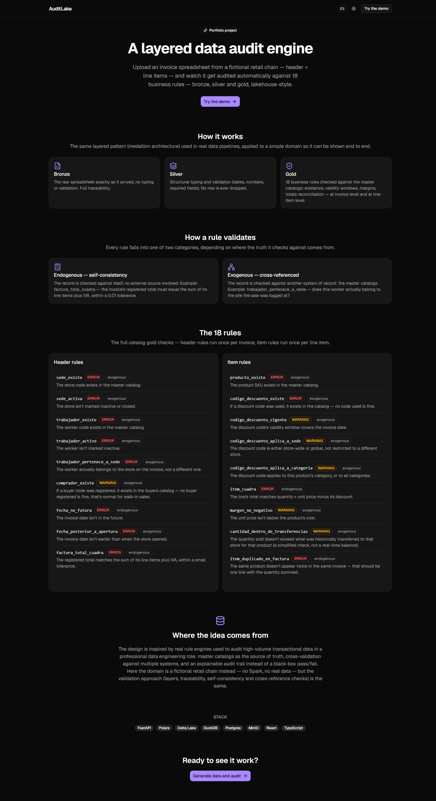
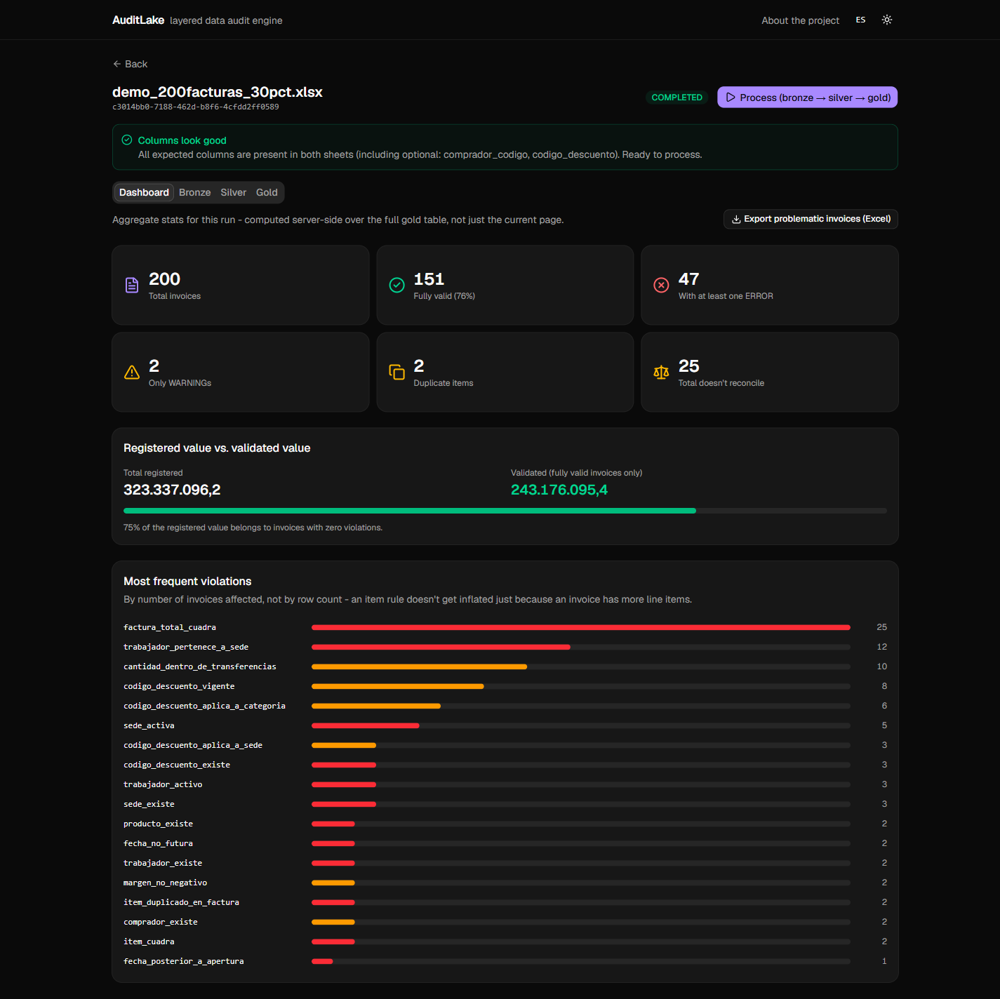
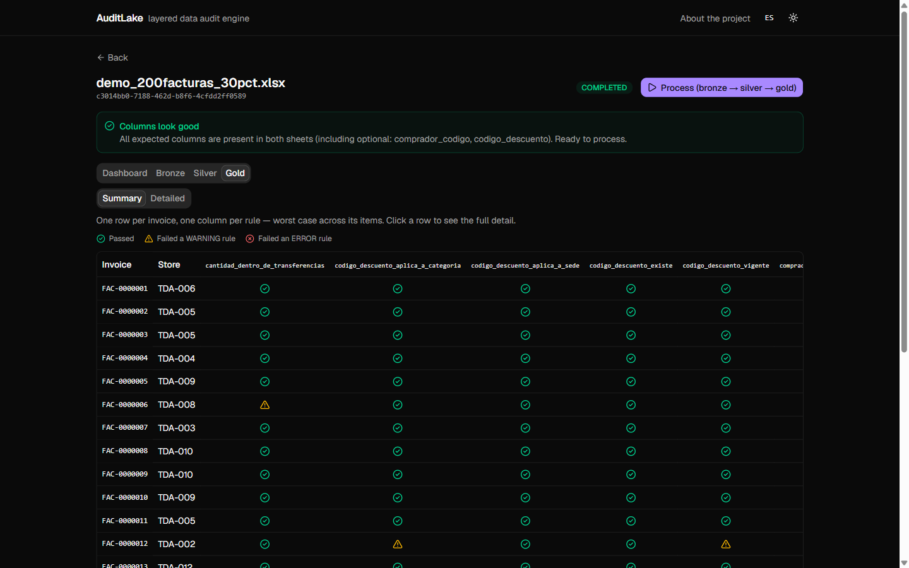
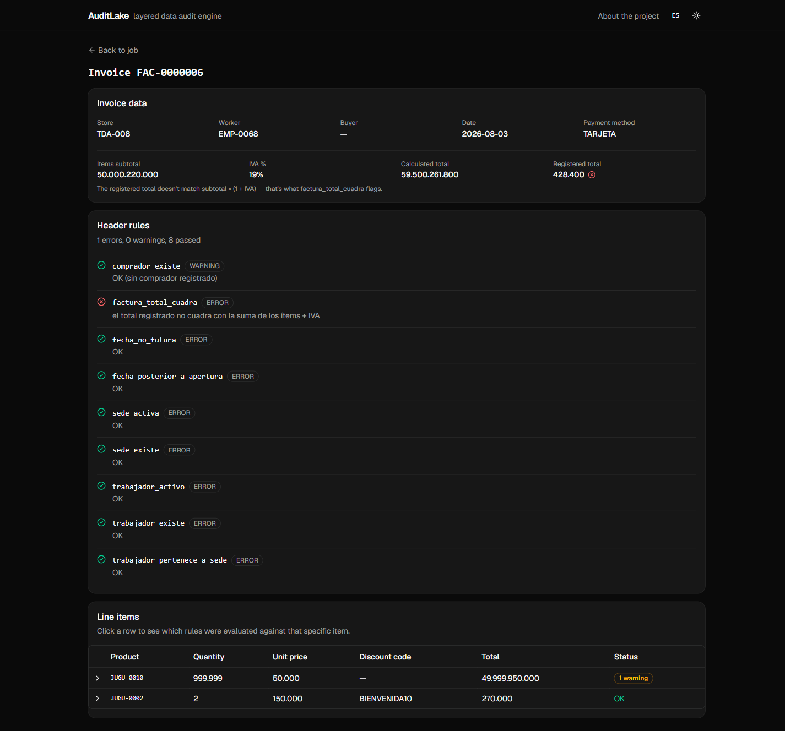
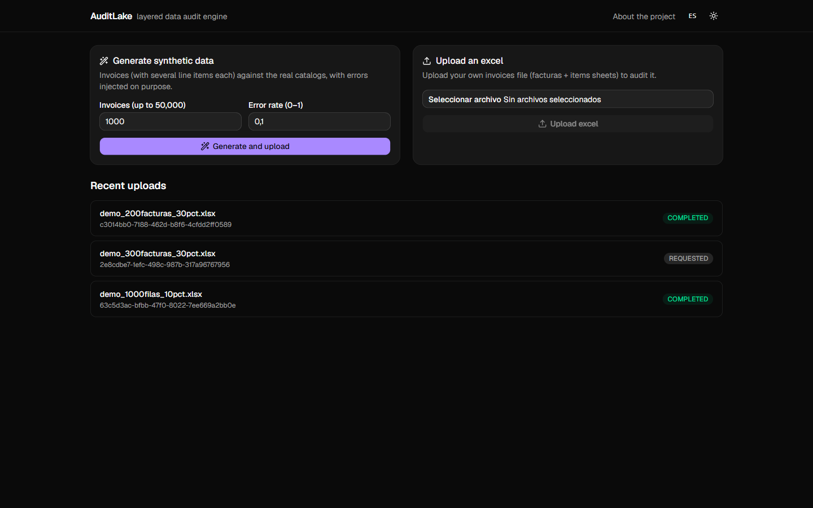

# AuditLake

**A layered (bronze / silver / gold) data audit engine for retail invoicing, built lakehouse-style without Spark.**

AuditLake ingests multi-item sales invoices for a fictional retail chain, runs them through a medallion pipeline, and produces an explainable audit trail: which rule was evaluated, against which invoice or line item, did it pass, and why. It's a portfolio project — the domain is invented, but the pipeline shape, the rule engine, and the kind of bugs it surfaces are modeled on real high-volume transactional-data auditing work.



## Why this exists

Before this, I audited high-volume transactional data — reconciling records against master catalogs, flagging structural and business-rule violations, explaining *why* something failed rather than just *that* it failed — using Databricks/Spark. AuditLake reimagines that same shape of problem (layered pipeline, static + catalog-driven validation rules, explainable output) on a fictional retail domain, without Spark and without any real data, so it can live in a public repo.

The rule that best captures what this project is about: **an invoice's registered total has to reconcile against the sum of its line items (plus tax).** That single check — cheap to state, easy to get wrong at scale, and exactly the kind of thing that silently breaks in real invoicing data — is why the domain models multi-item invoices (header + line items) instead of one flat row per sale.

## What it does

1. **Generate or upload** an Excel workbook of invoices (two sheets: invoice headers and line items). A built-in synthetic generator produces realistic data seeded from the same master catalogs the rule engine validates against, and can inject a configurable rate of specific rule violations on purpose — useful for demoing "here's a clean file" vs. "here's one with 30% errors."
2. **Run the pipeline** — bronze (raw, untyped, full traceability) → silver (typed, structurally validated, invalid rows kept and flagged, never dropped) → gold (every rule evaluated against every invoice/item, pass or fail, with severity).
3. **Explore the results**: an executive dashboard (valid vs. failing invoices, registered vs. validated value, which rules fail most), a summary matrix (one row per invoice, one column per rule, worst-case-per-invoice), a detailed row-level table, and a per-invoice detail page showing the header, its line items, and exactly which rule failed where.
4. **Export** the problematic invoices (and why) to a two-sheet Excel workbook for offline review.

## Rule engine: endogenous vs. exogenous

The 18 rules split along two axes: **scope** (header rules run once per invoice; item rules run once per line item) and **origin**:

- **Endogenous** — self-consistency checks that don't need an external source of truth. Example: `factura_total_cuadra` — the registered invoice total must equal the sum of its items' subtotals, times `(1 + IVA%)`.
- **Exogenous** — checks that cross-reference master catalogs (stores, employees, products, discount codes, transfers). Example: `codigo_descuento_aplica_a_categoria` — a discount code is only valid for the product categories it's scoped to.

Every rule carries a severity (`ERROR` blocks validity, `WARNING` flags without invalidating — e.g. an unrecognized buyer code, since most counter sales don't record one). The full catalog of all 18 rules — exact name, severity, scope, and what each one checks — lives in [`docs/DATA_MODEL.md`](docs/DATA_MODEL.md) and is also rendered as a live reference section on the app's landing page.

## Screenshots

| | |
|---|---|
| **Executive dashboard** — pass/fail breakdown, registered vs. validated value, rule failure ranking |  |
| **Summary matrix** — one row per invoice, one column per rule, worst case across items |  |
| **Invoice detail** — header reconciliation, per-rule results, expandable line items |  |
| **App home** — generate synthetic data or upload an Excel, recent uploads |  |

## Architecture

```
┌─────────────┐    excel (2 sheets: facturas + items)
│   Upload    │───────────────────────────────┐
└─────────────┘                                ▼
                                        ┌───────────────┐
                                        │     bronze     │  raw, untyped, full traceability
                                        └───────┬────────┘
                                                 ▼
                                        ┌───────────────┐
                                        │     silver     │  typed, structurally validated,
                                        └───────┬────────┘  invalid rows flagged, never dropped
                                                 │        + live snapshot of master catalogs
                                                 ▼
                                        ┌───────────────┐
                                        │      gold      │  every rule x every invoice/item,
                                        └───────┬────────┘  pass/fail + severity
                                                 ▼
                          DuckDB (delta_scan)  → dashboard, matrix, detail, export
```

- **Bronze / silver / gold are Delta Lake tables** on S3-compatible storage (MinIO locally, Cloudflare R2 in prod) — written and read with Polars + `deltalake` (delta-rs), no Spark cluster involved. This is the piece that gives the project its lakehouse authenticity.
- **DuckDB queries the lake directly** (`delta_scan()` over the Delta tables) to serve paginated, filtered, and aggregated results to the API without loading full tables into memory or duplicating data into another database.
- **Gold is re-runnable independently of bronze/silver**: master catalogs live in Postgres and can change without the source Excel changing, so gold can be regenerated from the already-persisted silver layer plus the current catalog state — no re-upload needed.
- **Backend layered by technical responsibility, not by feature** (`domain / infrastructure / api`), so the rule engine and pipeline stay pure Python + Polars, testable without spinning up FastAPI, Postgres, or MinIO. Full rationale in [`docs/ARCHITECTURE.md`](docs/ARCHITECTURE.md).

For the full reasoning behind every structural decision (why DuckDB over loading into memory, why Delta over plain Parquet, why two separate run/run-gold endpoints, why layers over "package by feature," etc.), see [`docs/ARCHITECTURE.md`](docs/ARCHITECTURE.md), [`docs/PLANNING.md`](docs/PLANNING.md) and [`docs/DATA_MODEL.md`](docs/DATA_MODEL.md) — all three are living documents kept in sync with the code throughout the project's history.

## Tech stack

| | |
|---|---|
| **Backend** | Python, FastAPI, SQLAlchemy, Polars, `deltalake` (delta-rs), DuckDB, Pydantic |
| **Data layer** | Delta Lake tables on MinIO (local) / Cloudflare R2 (prod) |
| **Operational DB** | PostgreSQL (job state, master catalogs) |
| **Frontend** | React 19, Vite, TypeScript, Tailwind CSS v4, shadcn/ui (Radix), TanStack Query, React Router |
| **Testing** | pytest (87 tests over the pure-domain layer — pipeline, rule engine, synthetic generator) |
| **Synthetic data** | Faker-seeded catalogs + a custom invoice generator that injects specific rule violations on demand |

No NestJS, no Spark — see `docs/PLANNING.md`/`docs/ARCHITECTURE.md` for why those were deliberately left out.

## Getting started

Requires Docker, Python 3.11+, and Node 18+.

**1. Infrastructure** (Postgres + MinIO):
```bash
docker-compose up -d
```

**2. Backend**:
```bash
cd apps/backend
python -m venv venv && venv\Scripts\activate   # or source venv/bin/activate on macOS/Linux
pip install -r requirements.txt
copy .env.example .env                          # or cp on macOS/Linux
python scripts/seed_catalog.py                  # seeds stores, employees, products, discount codes, buyers
uvicorn src.main:app --reload
```
The MinIO bucket is created automatically on first connection — no manual setup needed.

**3. Frontend**:
```bash
cd apps/frontend
npm install
npm run dev
```

Open the printed frontend URL, generate a synthetic Excel from the home screen (or upload your own following the two-sheet format documented in `docs/DATA_MODEL.md`), and run the pipeline.

## Project structure

```
apps/
  backend/
    src/
      domain/          # pure business logic — pipeline, rule engine, synthetic generator (no framework imports)
      infrastructure/   # Postgres, MinIO/R2, Delta, DuckDB adapters
      api/               # FastAPI routers + Pydantic schemas, one subfolder per feature
    tests/               # pytest, mirrors src/, covers domain/ only (the part with no external dependencies)
    scripts/             # seed_catalog.py and other one-off operational scripts
  frontend/
    src/
      pages/             # landing, home, job detail, invoice detail
      components/app/    # dashboard, gold table/matrix, column check, theme/language toggles
      lib/                # typed API client, session handling, pipeline orchestration, i18n, theme
docs/
  PLANNING.md          # product decisions, phases, what's in/out and why
  ARCHITECTURE.md      # how the code is organized, backend and frontend, with a full change history
  DATA_MODEL.md        # entities, per-layer schema, the full 18-rule catalog
docker-compose.yml     # local Postgres + MinIO
```

## Roadmap

- **Dynamic rules** — currently all 18 rules are hardcoded in `domain/rules/engine.py`. Next: a small rule DSL (or JSONLogic) backed by a Postgres table, editable from the frontend without touching code — e.g. adjustable max-discount-per-category thresholds.
- **Deploy** — free-tier first (Vercel + Render/Fly.io + Neon + Cloudflare R2), with a ~$5/mo VPS fallback if cold starts hurt the demo experience.

Full phase-by-phase history and what's explicitly out of scope (and why) in [`docs/PLANNING.md`](docs/PLANNING.md).
