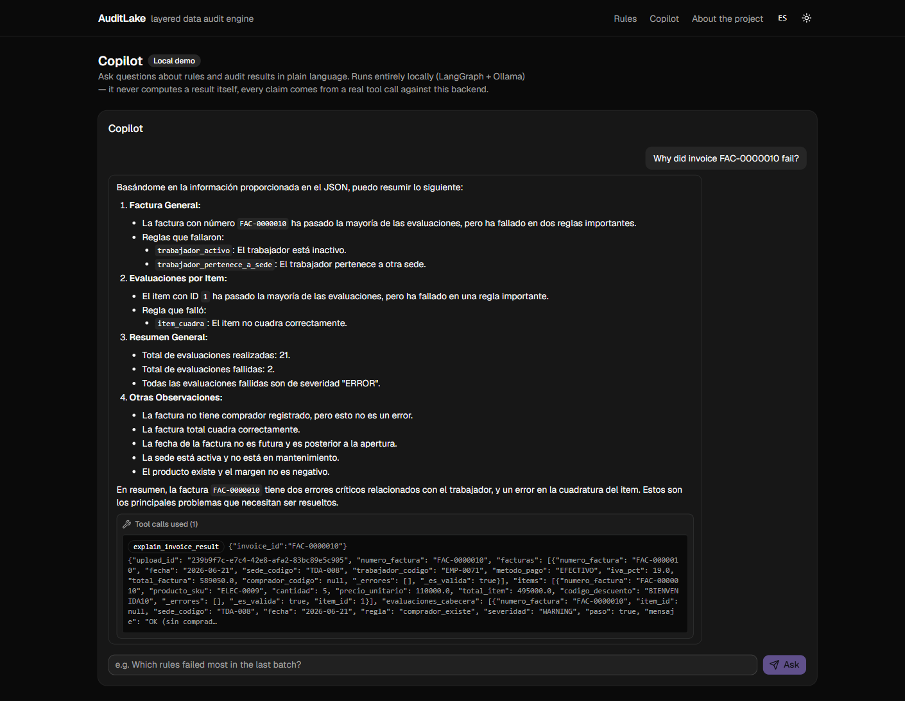

# AuditLake Copilot — Phases 1, 2, 3 & 4

A conversational agent over AuditLake's audit pipeline, built with LangGraph.
Full spec and rationale for the whole 4-phase plan: [`docs/copilot-spec.md`](../../docs/copilot-spec.md).
Covers Phase 1 (minimum viable agent, plus one tool added beyond the
original spec), Phase 2 (explaining why an invoice failed, plus one tool
added there too), Phase 3 (semantic search over rule docs with Qdrant,
indexed in both Spanish and English), and Phase 4 (the same tools over
MCP) — all explained below, with the real evidence that made each
addition (or fix) necessary. Beyond the spec's 4 phases, there's also a
minimal chat UI in the main frontend (`/app/copilot`) backed by a new
`POST /agent/ask` on the backend — see "Chat UI — a third consumer"
below.

## What it does

```
$ python -m agent "Which rules failed most often in dataset <upload_id>?"
The top 3 rules that failed most often are:
1. factura_total_cuadra (ERROR) - 7 invoices
2. cantidad_dentro_de_transferencias (WARNING) - 4 invoices
3. comprador_existe (WARNING) - 3 invoices
```

Every factual claim in that answer came from a real HTTP call to the running
backend — the agent never computes an audit result itself. If a rule name
doesn't exist or a dataset hasn't finished processing, it says so instead of
guessing.

## Why LangChain vs. LangGraph

LangChain is the toolbox — model wrappers, the `@tool` decorator, message
types. LangGraph (built on top of it) is the orchestrator: the agent is
modeled as a **state graph**, not a hand-rolled `while` loop. Nodes are units
of work (`agent` calls the LLM, `tools` executes whatever it asked for),
edges — including *conditional* edges — decide where to go next based on the
current state. That's what makes the step cap and the "loop until done"
behavior declarative instead of imperative: `route_after_agent()` (in
`agent/graph.py`) is the single place that decides tool-call vs. finalize vs.
stop, instead of that logic being scattered through a manual loop.

## Architecture

```
agent/
  settings.py   backend URL, Ollama config, Qdrant config, MAX_STEPS
  state.py      AgentState: messages (reducer: add_messages) + step_count
  tools.py      get_rule, query_gold_results, summarize_dataset,
                explain_invoice_result, run_rule (+ search_rule_docs, below)
  rag/
    index.py    builds the Qdrant index - `python -m agent.rag.index`
    retrieve.py search_rule_docs, wired into tools.TOOLS
  graph.py      the StateGraph: agent -> tools -> agent -> ... -> finalize/end
  __main__.py   `python -m agent "question"`
  mcp_server.py the same tools.TOOLS, registered under MCP instead of
                LangGraph - `python -m agent.mcp_server`
```

`agent -> tools` is the *only* dependency direction that matters here:
**the agent never imports the backend's `infrastructure/` layer.** It talks
to the already-running FastAPI backend over plain HTTP (`httpx`). This was a
deliberate decision (see `docs/PLANNING.md` §… agent phase) over importing
`infrastructure/storage/duckdb_query.py` directly: the agent needs zero
Postgres/R2 credentials of its own, and "the backend must be running to test
this" is an explicit, obvious requirement instead of a hidden one.

## The tools

### `get_rule(rule_id)`

Returns a rule's definition — built-in (18 hardcoded rules) or user-defined.
Checks user-defined rules first (`GET /rules/`), then falls back to a new
**static rule catalog** (`GET /rules/static/{name}`, backed by
`packages/domain/src/domain/rules/catalog.py`).

That catalog didn't exist before this phase. The spec's own instruction is
"if a tool needs logic that doesn't exist yet, stop and flag it rather than
inventing it" — the 18 built-in rules were only ever described as prose in
`docs/DATA_MODEL.md` and hardcoded Polars logic in `engine.py`, with no
queryable structured form. Adding `catalog.py` packages that same prose as
data (name, severity, scope, endogenous/exogenous, description) — zero new
business logic, and a module-level assertion keeps it in sync with
`engine.py`'s `NOMBRES_REGLAS_ESTATICAS` so it can't silently drift.

### `query_gold_results(rule_id, dataset_id, limit)`

Thin wrapper over the existing `GET /audits/{id}/gold/query`. `dataset_id`
is optional — omitting it fetches the most recently uploaded dataset first
(`GET /uploads/?limit=1`), for questions like "what failed in the last batch"
with no ID given.

### `summarize_dataset(dataset_id, top_n)` — added during Phase 1, not in the original spec

**Why this exists**: testing the spec's own example question — *"which
rules failed most often in dataset X"* — against `query_gold_results` alone
produced a wrong, rambling answer. A 7B local model asked to manually count
and rank raw gold rows (up to thousands of them) is not reliable at
arithmetic-over-a-list; it doesn't fail loudly, it just answers something
plausible-sounding and wrong for one invoice instead of the whole dataset.

The fix was not a bigger prompt — it was noticing that `GET
/audits/{id}/dashboard` (used by the existing web dashboard) **already
computes this exact ranking server-side**, sorted, over the full dataset. So
instead of asking the model to aggregate, `summarize_dataset` wraps that
endpoint and hands the model an already-sorted, already-truncated
(`top_n`, default 5) list. Same zero-new-logic constraint as the other two
tools — this is 100% reuse, just of a different existing endpoint.

Even with pre-aggregated data, the first version (no truncation) still
picked the wrong 3rd entry from an 18-item sorted list — truncating to 5
items server-side fixed it. Lesson kept here on purpose: **tool design for a
small local model means minimizing how much reasoning you ask it to do over
the tool's output, not just how much reasoning you ask it to do overall.**

### `explain_invoice_result(invoice_id, dataset_id)`

Thin wrapper over the existing `GET /audits/{id}/factura/{numero}` (the same
endpoint the invoice detail page uses) — every rule evaluated against one
invoice, header and item scope, from the last time gold ran. One thing that
endpoint does *not* do on its own: it returns `200` with empty lists for an
invoice number that doesn't exist, rather than a `404` — the tool checks
`facturas` is non-empty itself and turns that into `{"error": ...}` before
handing it to the model, so a typo'd invoice number doesn't get treated as
"an invoice with zero data" instead of "not found."

Also adds a pre-computed `resumen` (counts) and a `violaciones` list
(failing evaluations only) on top of the endpoint's raw response — see
"Known model limitations" below for why; this wasn't in the original design,
it's a fix for a real bug found testing this tool against Ollama.

### `run_rule(rule_id, invoice_id, dataset_id)` — added during Phase 2, not in the original spec

**Why this exists**: the spec's example question — *"run rule R-07 against
invoice 4821"* — implies recomputing live, not reading what gold already
says. That's a real gap: nothing in the app runs a single rule against a
single invoice; the closest thing, "Re-run gold," recomputes *all* rules for
*the whole dataset*. This was flagged and discussed before writing any code
(not silently built) — the concern was that recomputing on a filtered
subset might require real new business logic, which the spec says to avoid.

It didn't, in the end: `POST /audits/{id}/factura/{numero}/run-rule` (new
endpoint, `AuditService.run_rule_on_invoice`) reads that one invoice's
already-typed silver rows (`duckdb_query.get_dataframe_by_factura` — new,
see below) and the *current* catalog/dynamic-rule state, then calls
`to_gold()` — the exact same function `run-gold` already calls for a whole
dataset — on that one-invoice subset, and filters the output to the
requested rule. Zero new rule logic; the new code is orchestration glue
(read filtered, call the existing evaluator, filter the result).

**A real bug found building this, not a design decision**: the first
version read the invoice's silver rows as `list[dict]` (the existing
`get_rows_by_factura`) and rebuilt a Polars DataFrame from them by hand.
That silently broke `to_gold()` with a `SchemaError` whenever every row of
*this one invoice* happened to have `codigo_descuento = null` — Polars
infers an all-null column as type `Null` when building a DataFrame from raw
dicts, which then fails to join against the catalog's `Utf8` column. The
fix was `get_dataframe_by_factura`, a duckdb_query.py function that returns
the DuckDB/Delta-backed DataFrame directly instead of round-tripping through
dicts — it keeps Delta's real schema (a nullable Utf8 column stays Utf8
regardless of which values happen to be null in a given subset). Lesson:
"convert to dicts and back" is not a neutral operation for a typed data
pipeline, even when it looks like one.

### `search_rule_docs(query, k)` — Phase 3, semantic search with Qdrant

`get_rule` needs the rule's exact name. This is for when the user doesn't
know it — "is there a rule about discount limits on clothing" instead of
"what does descuento_maximo_ropa check."

**Indexing** (`agent/rag/index.py`, run offline/on-demand — `python -m
agent.rag.index` — not on every question): fetches all 21 rules (18
built-in via `GET /rules/static`, plus whatever's in `GET /rules/` — same
HTTP-to-backend pattern as every other tool, not a second way of reading
rule data), builds **one chunk per rule per language** (name + description
+ severity + scope — chosen over fixed-size windows because each rule's
description is already short and self-contained; splitting it further
would only fragment it for no benefit), embeds each chunk with
`nomic-embed-text` via Ollama (274MB, local, no API key, consistent with
using Ollama for the chat model too), and upserts into a Qdrant
collection (39 points: 18 built-in rules × 2 languages + 3 dynamic × 1).
Re-running the script updates in place rather than duplicating — each
point's ID is a UUID deterministically derived from `(nombre, idioma)`
(`uuid.uuid5(uuid.NAMESPACE_DNS, f"{nombre}:{idioma}")`; Qdrant requires
an int or UUID for point IDs, not an arbitrary string).

**A real, measured finding, not assumed**: search quality is sharply
language-dependent. First version indexed rule descriptions in Spanish
only. Querying in Spanish (`"regla que verifica que el trabajador
pertenezca a la sede correcta"`) returned the correct rule first with a
clear score gap (0.738 vs. 0.672 for 2nd place). The *same question in
English* ("checks if a worker belongs to the right store") returned three
*wrong* rules, scores clustered tightly around 0.47 — the correct rule
wasn't even in the top 3. Reproduced on a second query pair (date-related)
with the same pattern. `nomic-embed-text` isn't strongly cross-lingual; an
English query against a Spanish-only corpus doesn't reliably land near
the right vectors.

**First fix, a cheap mitigation**: rather than touching the index,
`search_rule_docs`'s docstring instructed the model to translate the
query to Spanish itself before searching, with the measured scores
included as evidence. This worked — verified end to end, asked in
English, the agent translated on its own and found the right rule — but
it depends on the model reliably choosing to translate every time, and it
does nothing for a corpus that's genuinely meant to be read in both
languages by a real user (the app itself has an ES/EN toggle).

**Better fix, once it was worth the extra work**: the app already had
real English text for all 18 built-in rules — `apps/frontend/src/i18n/
translations.ts`'s `rule.*` keys, written for the landing page, not
invented for this. Copied (not re-translated) into a new
`descripcion_en` field on `packages/domain/.../catalog.py`'s
`DescripcionRegla` (exposed via `GET /rules/static`), and `index.py` now
indexes **both** languages per built-in rule. User-defined rules stay
Spanish-only — there's no real English text for what a user typed
creating one, so none was fabricated. Re-ran the exact two English
queries that originally failed, without any translation step: both now
return the correct rule *first*, with a clean score gap (0.658 vs. 0.54;
0.683 vs. 0.641) — matching the quality Spanish queries already had, not
just "good enough." `search_rule_docs` also now deduplicates results by
rule name (querying `k * 3` candidates and keeping the best-scoring chunk
per rule), since a built-in rule can now match on either of its two
indexed chunks and shouldn't take two slots in the same result list.

## Known model limitations (not tool bugs)

Two failure modes showed up live, both about the *last* step — the model
narrating a tool's result — not about the tools or their data:

- **Aggregation over raw rows is unreliable** (Phase 1, see
  `summarize_dataset` above) — fixed by pre-aggregating server-side instead
  of asking the model to count.
- **Summarizing a longer already-correct list was not reliably faithful**
  (Phase 2, found testing `explain_invoice_result`): asked to summarize an
  invoice with ~20 rule evaluations (only 1 actually failing), the model
  correctly *listed* every rule's real status, then wrote a closing summary
  claiming "4 errors" and describing problems ("discount code issues") that
  contradicted its own list two lines above — reproduced twice. Same shape
  as the aggregation bug, so fixed the same way: `explain_invoice_result`
  now returns a pre-computed `resumen` (`total_evaluaciones`,
  `total_fallidas`, `fallidas_error`, `fallidas_warning`) and a `violaciones`
  list containing only the failing evaluations, instead of leaving the model
  to derive those numbers from ~20 raw rows itself. The system prompt
  (`graph.py`) also now explicitly says to use any pre-counted field
  ("resumen", "total_*") as-is rather than recompute it. Retested the exact
  question that reproduced the bug: the model now reports "1 fallida, 0
  advertencias," matching the real data. **Fixed, verified against a real
  rerun, not just assumed from the code change.**
- **Still not fixed**: the model ignores an explicit "answer in one
  sentence" / "only the header rules" instruction and produces the full
  unfiltered breakdown anyway, even in the retest above — an
  instruction-following gap, distinct from the factual-accuracy one that's
  now fixed. No equivalent "pre-compute it" escape hatch applies here since
  the ask is about response *format*, not the numbers in it; worth trying a
  stronger model or a firmer system-prompt instruction before Phase 3, not
  worth guessing at blind.
- **Cross-checked with a stronger model, same tool, same data**: asked "which
  rules failed most" through Claude Desktop over the MCP server (Phase 4) -
  same `summarize_dataset` call, same already-sorted `reglas` list
  (`[7, 4, 3, 3, 2]` facturas_afectadas). Claude read the list top to bottom
  and reported it in the correct order; `qwen2.5:7b` (the LangGraph agent's
  own model, asked the equivalent question through `/app/copilot`) reordered
  two entries with the same count incorrectly despite the identical
  pre-sorted input and the identical system-prompt instruction not to
  re-sort it. Confirms this is a small-model instruction-following ceiling,
  not a bug in `summarize_dataset` or in how the data is prepared - the tool
  layer is doing its job correctly regardless of which model reads its
  output.

## The graph

```
START -> agent -> (has tool_calls? -> tools -> agent, loop)
                -> (no tool_calls? -> END)
                -> (tool_calls AND step_count >= MAX_STEPS? -> finalize -> END)
```

- **`agent` node**: calls `ChatOllama` with the three tools bound, increments
  `step_count`.
- **`tools` node**: LangGraph's prebuilt `ToolNode` — executes whatever the
  model asked for, appends `ToolMessage`s to state.
- **`finalize` node**: only reached at the step cap. Calls the model *once
  more, with tools unbound*, explicitly told to stop asking for tools and
  answer in plain text from whatever's already in the message history. This
  exists so hitting the cap produces a partial answer instead of an
  AIMessage whose only content is an unresolved tool call.

**Step cap**: `settings.MAX_STEPS = 8` (env-overridable). Without a hard cap,
a model stuck in "let me check one more thing" has no reason to stop; a
portfolio agent that can hang indefinitely on a bad prompt is a worse demo
than one that visibly gives up gracefully. 8 was picked as "generous enough
for a 2-3 tool-call chain with room to recover from one bad call," not
tuned against real failure data yet.

**Checkpointing**: none, on purpose, for now. Phase 1 is a one-shot CLI
(`python -m agent "question"`) — every invocation starts a fresh
`{"messages": [...], "step_count": 0}`, there's no conversation to resume
between calls. A checkpointer (`langgraph.checkpoint`) would matter once
there's a persistent session — the MCP server in Phase 4 is the more likely
place that becomes necessary, revisit there.

## Tool failure handling

Each tool catches `httpx.HTTPError` and 404s itself, returning `{"error":
"..."}` (or `[{"error": "..."}]` for the list-returning tools) as a normal
successful return value, rather than letting an exception propagate.
LangGraph's `ToolNode` already has its own default exception handling
(`_default_handle_tool_errors`, turns a raised exception into a `ToolMessage`
automatically) — this is a deliberate choice on top of that, not a
workaround for its absence: it keeps every tool's return shape consistent
(always the tool's normal dict/list shape, error or not) instead of two
different shapes depending on whether something raised. The model sees the
error string either way and is instructed (system prompt in `graph.py`) to
say it doesn't know rather than paper over it — verified in
`test_get_rule_reports_error_when_backend_unreachable` and by hand (asking
about a rule name that doesn't exist correctly produces "that rule doesn't
exist," not a hallucinated description).

## Measured token cost

One real run of the example question above (`qwen2.5:7b` via Ollama,
`temperature=0`), 2 steps (1 tool call):

| | input tokens | output tokens |
|---|---|---|
| Step 1 (agent decides to call `summarize_dataset`) | 1,226 | 61 |
| Step 2 (agent reads the tool result, answers) | 1,601 | 178 |
| **Total** | **2,827** | **239** |

**3,066 tokens for one grounded answer.** Most of the input-token cost is
the system prompt + tool schemas being re-sent on every step (LangGraph
resends the full message history each turn, not a diff) — this is the
expected cost of a stateless-per-call tool-calling loop, and the main lever
for reducing it later would be trimming tool docstrings/schemas rather than
the system prompt, since the docstrings are what feeds the model's picture
of what each tool does.

## MCP server — Phase 4

`mcp_server.py` registers the exact same `tools.TOOLS` functions under the
[Model Context Protocol](https://modelcontextprotocol.io/) instead of
LangGraph — "one definition, two consumers" (`docs/copilot-spec.md`'s own
wording for this phase): if a tool's behavior changes in `tools.py`, both
the LangGraph agent and the MCP server see the change automatically,
there's nothing to keep in sync by hand. Uses `mcp.server.mcpserver.
MCPServer.add_tool(fn, name=..., description=...)`, registering each
tool's already-existing `.func` (the raw callable), `.name`, and
`.description` straight from the LangChain `@tool` objects — no tool gets
redefined a second time.

**A real version gotcha, caught before writing any code**: `mcp` 2.x
renamed `FastMCP` to `MCPServer` and moved it to `mcp.server.mcpserver` -
the old `from mcp.server.fastmcp import FastMCP` (still the example in
most tutorials, written against `mcp` 1.x) raises `ModuleNotFoundError`
with the new package's own migration message pointing at the rename.
Checked the actually-installed API (`dir(MCPServer)`, `inspect.signature`)
before writing `mcp_server.py`, same lesson as the LangChain/LangGraph
version surprise earlier in this project - a training-data API and an
installed package's real API aren't the same thing, verify before coding.

**Verified with a real MCP client, not just an import check**: wrote a
throwaway script using `mcp.client.stdio.stdio_client` +
`mcp.ClientSession` to connect to `mcp_server.py` as a real client would,
called `session.list_tools()` (got back all 6, correct names) and
`session.call_tool("get_rule", {"rule_id": "sede_existe"})` (got back the
real rule definition, not a mock). `tests/test_mcp_server.py` covers the
registration itself (all 6 tools present, names and descriptions match
`tools.TOOLS`) without needing a live subprocess per test run.

**Connecting a real local MCP client** (e.g. Claude Desktop, Claude
Code): add to the client's MCP server config (for Claude Desktop,
`claude_desktop_config.json`). Use `env.PYTHONPATH` pointing at
`apps/agent`, not a `cwd` field - same reasoning as the `-e
PYTHONPATH=...` workaround used for `claude mcp add` above, and it
sidesteps having to confirm whether a given client's config schema even
honors `cwd` for stdio servers:

```json
{
  "mcpServers": {
    "auditlake-copilot": {
      "command": "C:\\path\\to\\apps\\agent\\venv\\Scripts\\python.exe",
      "args": ["-m", "agent.mcp_server"],
      "env": {
        "PYTHONPATH": "C:\\path\\to\\apps\\agent"
      }
    }
  }
}
```

**Finding `claude_desktop_config.json` on a Microsoft Store (MSIX)
install of Claude Desktop**: it is not at the usual
`%APPDATA%\Claude\claude_desktop_config.json` - MSIX apps get a
virtualized filesystem, so it actually lives under
`%LOCALAPPDATA%\Packages\<Claude package id>\LocalCache\Roaming\Claude\
claude_desktop_config.json` (the package id is a fixed per-install
string, e.g. `Claude_pzs8sxrjxfjjc` - find it with `dir
%LOCALAPPDATA%\Packages | findstr Claude`). Verified: the file starts
with no `mcpServers` key at all on a fresh install (just `preferences`
and `coworkUserFilesPath`) - it's a plain key to add, not one to merge
carefully into an existing block.

Requires the backend running, same as the LangGraph agent (see
"Architecture" above) - the tools are unchanged, still HTTP calls to
`apps/backend`.

## Chat UI — a third consumer, over HTTP

The CLI and the MCP server aren't the only front-ends: `apps/backend`
exposes `POST /agent/ask` (`apps/backend/src/api/agent/`), which runs
this same `build_graph()` and returns `{answer, tool_calls}` - the
`tool_calls` list is extracted straight from the graph's final state
(`AIMessage.tool_calls` matched to their `ToolMessage` results), not
free text, so the frontend can show exactly which tool ran with which
arguments. The frontend's `/app/copilot` page is a minimal chat built on
that endpoint, with the tool-call trace shown as a collapsed detail per
answer.


*A real run: "why did invoice FAC-0000010 fail?", answered from
`explain_invoice_result`'s actual output - the expanded trace below the
answer shows the exact tool call and raw result, not a mocked example.*

This is a third consumer of `tools.py`/`graph.py`, same principle as
MCP - "one definition, three consumers" by this point. It's still a
local-only demo: the backend imports `agent.graph` by adding
`apps/agent` to `sys.path` at request time (same trick as connecting an
MCP client without a `--cwd` flag, see above), so Render's deployed
backend doesn't need `langgraph`/`qdrant-client`/etc. installed unless
someone actually uses the chat - it returns a 503 with a readable
message if the import fails or if Ollama/Qdrant aren't reachable when
the graph actually runs. To use it locally: install this app's
`requirements.txt` into the backend's own venv too
(`apps/backend/venv/Scripts/pip install -r ../agent/requirements.txt`),
since the import happens inside the backend's process, not a separate
one.

**Hidden on the hosted demo, on purpose**: the deployed frontend
(Vercel) always ships `VITE_COPILOT_AVAILABLE=false`, which makes
`/app/copilot` render a short "run this locally" notice with a link
back to this README instead of a chat that would just 503 on every
question - the deployed Render backend has no Ollama/Qdrant to talk to.
Local dev needs nothing set (any value other than the literal string
`"false"` counts as enabled) - see `apps/frontend/.env.example`.

**A real bug found wiring this up**: `agent/settings.py` loaded its
`.env` with a relative path (`env_file=".env"`), which
`pydantic-settings` resolves against the process's current working
directory, not the file's location. That's fine when running
`apps/agent` on its own (cwd = `apps/agent`), but broke the moment the
backend imported this module - the cwd was `apps/backend`, so this
`Settings` tried to load *the backend's* `.env` (`DATABASE_URL`,
`S3_*`, `CORS_ORIGINS`, ...) and failed validation with "extra inputs
not permitted" for every one of those keys. Fixed by resolving the
`.env` path absolutely, relative to `settings.py` itself
(`Path(__file__).resolve().parent.parent / ".env"`), so it no longer
depends on which process imports it.

## Setup

```bash
cd apps/agent
python -m venv venv && venv\Scripts\activate   # or source venv/bin/activate
pip install -r requirements.txt
copy .env.example .env                          # BACKEND_BASE_URL defaults to localhost:8000

ollama pull qwen2.5:7b                          # confirmed to support real tool-calling, not just prose
ollama pull nomic-embed-text                    # embeddings for Phase 3's search_rule_docs
ollama serve                                    # if not already running

docker run -d --name qdrant -p 6333:6333 -p 6334:6334 \
  -v "$(pwd)/qdrant_storage:/qdrant/storage" qdrant/qdrant
python -m agent.rag.index                       # builds the search index - run once, or after rules change

python -m agent "your question here"
```

Requires the backend running (`apps/backend`, see its own README/`.env`) —
by design, see "Architecture" above.

## Testing

```bash
python -m pytest -v
```

21 tests: unit tests for all six tools (backend mocked at the `httpx`
boundary, Qdrant/embeddings mocked for `search_rule_docs` — same standard
as `packages/domain`'s 100 tests), the MCP server's tool registration
(`test_mcp_server.py`, verifies the same 6 tools/names/descriptions are
exposed — the actual protocol round-trip was verified by hand with a
real MCP client, see "MCP server" above), plus two graph integration
tests with the LLM itself scripted — asserting on the tool-call
sequence and message shape (`test_graph_calls_tool_then_answers`), and on
the step cap producing a partial answer instead of hanging
(`test_graph_stops_at_step_cap_with_a_partial_answer`) — never on a real
model's exact wording, which isn't deterministic.
