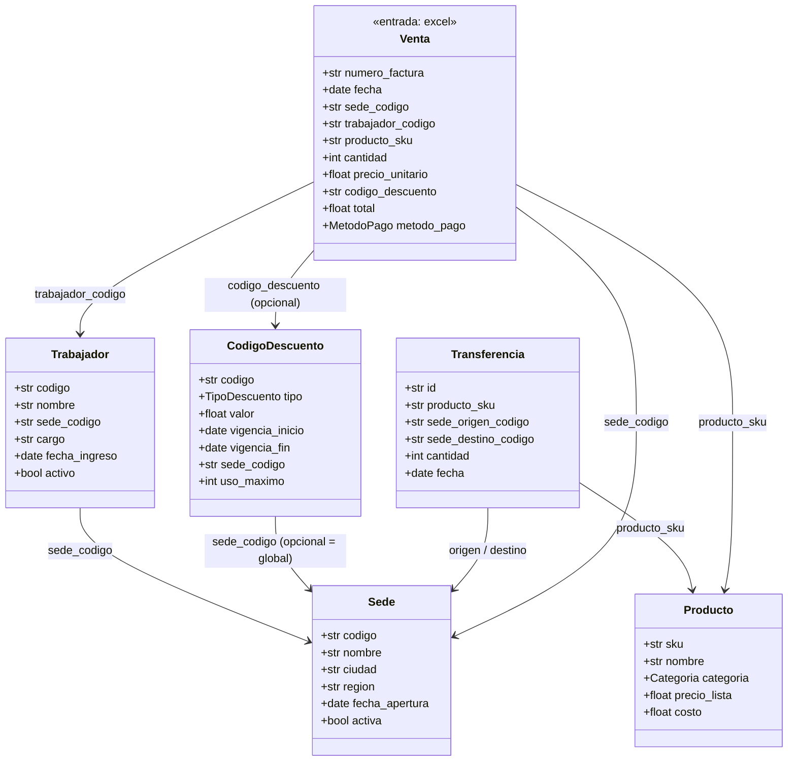

# Modelo de datos

> Complementa a `PLANNING.md` (producto) y `ARCHITECTURE.md` (código). Este
> documento es sobre **qué forma tienen los datos**: las entidades del
> dominio y el esquema de entrada/salida de cada capa del pipeline. Se
> actualiza cada vez que cambia una columna, un tipo, o se agrega una
> entidad — es la referencia para saber qué espera el sistema del excel
> que se sube.

## Entidades y relaciones

`Venta` es la entidad de **entrada** (una fila del excel subido). Referencia
a los catálogos maestros por código, igual que una factura real referencia
códigos de producto/procedimiento en un sistema transaccional.

Los catálogos (`Sede`, `Trabajador`, `Producto`, `CodigoDescuento`,
`Transferencia`) viven como tablas Postgres — fuente de verdad en
`infrastructure/db/catalog/models.py`, sembradas por `scripts/seed_catalog.py`.
`Venta` no tiene tabla propia todavía: es el esquema que el pipeline espera
del excel — fuente de verdad en `domain/ventas.py`.

## Esquema de entrada: excel de ventas

Columnas esperadas en la hoja subida (nombres de columna exactos, primera
fila como encabezado):

| Columna | Tipo esperado | Obligatoria | Referencia | Notas |
|---|---|---|---|---|
| `numero_factura` | texto | sí | — | identificador de la venta, no se valida unicidad en silver (eso sería gold) |
| `fecha` | fecha `YYYY-MM-DD` | sí | — | |
| `sede_codigo` | texto | sí | `Sede.codigo` | la existencia contra el catálogo se valida en gold, no en silver |
| `trabajador_codigo` | texto | sí | `Trabajador.codigo` |ídem |
| `producto_sku` | texto | sí | `Producto.sku` |ídem |
| `cantidad` | entero positivo | sí | — | acepta `"2"` o `"2.0"`, rechaza `"2.5"` |
| `precio_unitario` | número positivo | sí | — | |
| `codigo_descuento` | texto | no | `CodigoDescuento.codigo` | vacío/nulo = sin descuento |
| `total` | número positivo | sí | — | que cuadre con `cantidad × precio_unitario − descuento` se valida en gold |
| `metodo_pago` | uno de `MetodoPago` | sí | `domain/ventas.py` | `EFECTIVO`, `TARJETA`, `TRANSFERENCIA` |

Fuente de verdad en código: `domain/ventas.py`
(`VENTA_COLUMNAS_REQUERIDAS`, `VENTA_COLUMNAS_OPCIONALES`, `MetodoPago`).

## Esquema de salida por capa

### Bronze

Mismas columnas que llegaron en el excel, **todas como texto** (`Utf8`),
sin agregar ni quitar nada. Ver `domain/pipeline/bronze.py`.

### Silver

Mismas columnas que `Venta`, pero tipadas, más dos columnas de
trazabilidad. Ver `domain/pipeline/silver.py`.

| Columna | Tipo |
|---|---|
| `numero_factura` | `Utf8` |
| `fecha` | `Date` (o `null` si no parseó) |
| `sede_codigo` | `Utf8` |
| `trabajador_codigo` | `Utf8` |
| `producto_sku` | `Utf8` |
| `cantidad` | `Int64` (o `null` si no era entero positivo) |
| `precio_unitario` | `Float64` (o `null` si no era positivo) |
| `total` | `Float64` (o `null` si no era positivo) |
| `metodo_pago` | `Utf8` |
| `codigo_descuento` | `Utf8`, nullable |
| `_errores` | `List[Utf8]` — mensajes de validación estructural que falló |
| `_es_valida` | `Bool` — `_errores` vacío |

Silver **no** descarta filas ni valida contra los catálogos (eso es
referencial/de negocio, no estructural) — solo tipo/formato/obligatoriedad.
Si el excel no tiene ni las columnas mínimas, `to_silver` lanza
`SilverSchemaError` en vez de producir una tabla (error de archivo
completo, no de fila).

### Gold — pendiente

Una fila por (factura, regla de negocio evaluada): existencia en
catálogos, vigencia de descuentos, márgenes, cuadre de totales, etc. Se
documenta acá cuando se construya — ver `PLANNING.md` §4 para el catálogo
de reglas previstas.

## Convención de rutas del pipeline en el bucket

Ver `ARCHITECTURE.md` → "Convención de rutas en el bucket"
(`jobs/{upload_id}/upload|bronze|silver|gold/`).
