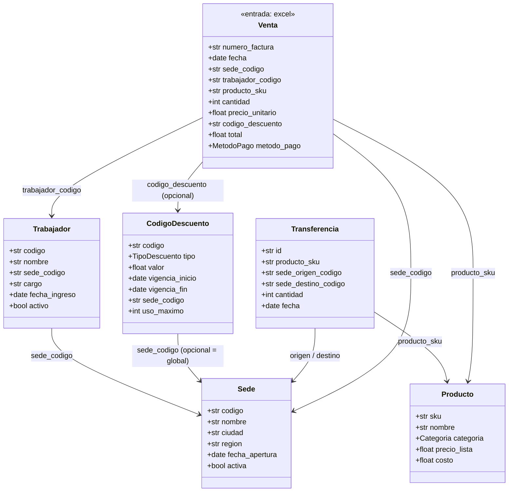

# Modelo de datos

> Complementa a `PLANNING.md` (producto) y `ARCHITECTURE.md` (código). Este
> documento es sobre **qué forma tienen los datos**: las entidades del
> dominio y el esquema de entrada/salida de cada capa del pipeline. Se
> actualiza cada vez que cambia una columna, un tipo, o se agrega una
> entidad — es la referencia para saber qué espera el sistema del excel
> que se sube.

## Entidades y relaciones

`Venta` es la entidad de **entrada** (una fila del excel subido). Referencia
a los catálogos maestros por código, igual que una factura real referencia
códigos de producto/procedimiento en un sistema transaccional.

Los catálogos (`Sede`, `Trabajador`, `Producto`, `CodigoDescuento`,
`Transferencia`) viven como tablas Postgres — fuente de verdad en
`infrastructure/db/catalog/models.py`, sembradas por `scripts/seed_catalog.py`.
`Venta` no tiene tabla propia todavía: es el esquema que el pipeline espera
del excel — fuente de verdad en `domain/ventas.py`.

## Esquema de entrada: excel de ventas

Columnas esperadas en la hoja subida (nombres de columna exactos, primera
fila como encabezado):

| Columna | Tipo esperado | Obligatoria | Referencia | Notas |
|---|---|---|---|---|
| `numero_factura` | texto | sí | — | identificador de la venta, no se valida unicidad en silver (eso sería gold) |
| `fecha` | fecha `YYYY-MM-DD` | sí | — | |
| `sede_codigo` | texto | sí | `Sede.codigo` | la existencia contra el catálogo se valida en gold, no en silver |
| `trabajador_codigo` | texto | sí | `Trabajador.codigo` |ídem |
| `producto_sku` | texto | sí | `Producto.sku` |ídem |
| `cantidad` | entero positivo | sí | — | acepta `"2"` o `"2.0"`, rechaza `"2.5"` |
| `precio_unitario` | número positivo | sí | — | |
| `codigo_descuento` | texto | no | `CodigoDescuento.codigo` | vacío/nulo = sin descuento |
| `total` | número positivo | sí | — | que cuadre con `cantidad × precio_unitario − descuento` se valida en gold |
| `metodo_pago` | uno de `MetodoPago` | sí | `domain/ventas.py` | `EFECTIVO`, `TARJETA`, `TRANSFERENCIA` |

Fuente de verdad en código: `domain/ventas.py`
(`VENTA_COLUMNAS_REQUERIDAS`, `VENTA_COLUMNAS_OPCIONALES`, `MetodoPago`).

## Esquema de salida por capa

### Bronze

Mismas columnas que llegaron en el excel, **todas como texto** (`Utf8`),
sin agregar ni quitar nada. Ver `domain/pipeline/bronze.py`.

### Silver

Mismas columnas que `Venta`, pero tipadas, más dos columnas de
trazabilidad. Ver `domain/pipeline/silver.py`.

| Columna | Tipo |
|---|---|
| `numero_factura` | `Utf8` |
| `fecha` | `Date` (o `null` si no parseó) |
| `sede_codigo` | `Utf8` |
| `trabajador_codigo` | `Utf8` |
| `producto_sku` | `Utf8` |
| `cantidad` | `Int64` (o `null` si no era entero positivo) |
| `precio_unitario` | `Float64` (o `null` si no era positivo) |
| `total` | `Float64` (o `null` si no era positivo) |
| `metodo_pago` | `Utf8` |
| `codigo_descuento` | `Utf8`, nullable |
| `_errores` | `List[Utf8]` — mensajes de validación estructural que falló |
| `_es_valida` | `Bool` — `_errores` vacío |

Silver **no** descarta filas ni valida contra los catálogos (eso es
referencial/de negocio, no estructural) — solo tipo/formato/obligatoriedad.
Si el excel no tiene ni las columnas mínimas, `to_silver` lanza
`SilverSchemaError` en vez de producir una tabla (error de archivo
completo, no de fila).

### Gold

Una fila por **cada (factura, regla evaluada)** — incluye tanto lo que
pasó como lo que falló (`paso: true/false`), no solo las violaciones.
Genera `domain/rules/engine.py`, orquestado por `domain/pipeline/gold.py`.

| Columna | Tipo | Notas |
|---|---|---|
| `numero_factura` | `Utf8` | |
| `sede_codigo` | `Utf8` | denormalizado desde silver, para filtrar sin join |
| `fecha` | `Date` | ídem |
| `regla` | `Utf8` | nombre de la regla, ver tabla abajo |
| `severidad` | `Utf8` | `ERROR` \| `WARNING` |
| `paso` | `Bool` | |
| `mensaje` | `Utf8` | `"OK"` si pasó, explicación si no |

**Reglas estáticas v1** (las dinámicas/configurables por JSONLogic son un
motor aparte, pendiente — ver `PLANNING.md` §7):

Cada regla es **endógena** (compara la fila contra sí misma, ninguna fuente
externa) o **exógena** (compara la fila contra otra fuente de verdad: los
catálogos maestros). Es la misma distinción que se explica en la landing
page (`landing.validationTitle`) — acá está aplicada regla por regla.

| Regla | Severidad | Tipo | Qué valida |
|---|---|---|---|
| `sede_existe` | ERROR | exógena | `sede_codigo` existe en el catálogo |
| `sede_activa` | ERROR | exógena | la sede no está inactiva/cerrada (N/A si no existe) |
| `trabajador_existe` | ERROR | exógena | `trabajador_codigo` existe |
| `trabajador_activo` | ERROR | exógena | el trabajador no está inactivo (N/A si no existe) |
| `trabajador_pertenece_a_sede` | ERROR | exógena | el trabajador es de esa sede, no otra (N/A si no existe) |
| `producto_existe` | ERROR | exógena | `producto_sku` existe |
| `codigo_descuento_existe` | ERROR | exógena | si se usó un código, que exista (N/A si no se usó) |
| `codigo_descuento_vigente` | WARNING | exógena | la fecha de venta cae en la vigencia del código |
| `codigo_descuento_aplica_a_sede` | WARNING | exógena | el código es global o es de esa sede |
| `factura_cuadra` | ERROR | endógena | `total ≈ cantidad × precio_unitario − descuento` (tolerancia 0.01) |
| `margen_no_negativo` | WARNING | exógena | `precio_unitario ≥ costo` del producto |
| `fecha_no_futura` | ERROR | endógena | la venta no es de una fecha futura |
| `fecha_posterior_a_apertura` | ERROR | exógena | la venta no es anterior a que la sede abriera |
| `factura_no_duplicada` | ERROR | endógena | `numero_factura` no se repite **dentro del mismo excel** (no compara contra auditorías anteriores) |
| `cantidad_dentro_de_transferencias` | WARNING | exógena | chequeo **simplificado**: suma total histórica de transferencias hacia esa sede para ese SKU ≥ cantidad vendida (no es un balance temporal ordenado por fecha — ver "Abierto" en `PLANNING.md`) |

Una regla "N/A" (el prerequisito no existe, ej. el trabajador no existe)
pasa de forma vacía — no se penaliza dos veces el mismo problema de raíz.

**Nota sobre `factura_cuadra`**: en este dominio cada fila es una venta
completa (una factura = un renglón, ver `factura_no_duplicada`), así que
la reconciliación de totales pasa a nivel de fila (`total` contra
`cantidad × precio_unitario − descuento`), no como suma de varios
renglones de una misma factura — el dominio no modela facturas
multi-ítem. Es la misma idea que "el total de la factura debe cuadrar
con la suma de sus ítems" en un sistema transaccional real, adaptada a
un esquema de una sola fila por venta.

**Re-ejecución independiente**: `gold` se puede regenerar sin volver a
subir el excel ni rehacer bronze/silver — lee el `silver` ya guardado en
Delta + el estado **actual** de los catálogos en Postgres (`POST
/audits/{id}/run-gold`, ver `ARCHITECTURE.md`). Útil para re-auditar
después de corregir algo en un catálogo.

**Generador sintético**: `domain/demo/generator.py` (`POST
/demo/generate-excel`) inyecta violaciones usando estos mismos nombres de
regla (más 6 tipos a nivel silver: `numero_factura_vacio`,
`fecha_invalida`, `cantidad_invalida`, `precio_unitario_invalido`,
`total_invalido`, `metodo_pago_no_reconocido`) — así el reporte de "qué se
inyectó" se puede comparar directo contra la columna `regla` de gold. El
conteo inyectado es una aproximación por lo bajo: algunas mutaciones
cascadean a otras reglas de forma legítima (ej. una sede inexistente
también hace fallar `trabajador_pertenece_a_sede`), así que gold puede
detectar más de lo que el generador contó — eso es correcto, no un bug.

## Convención de rutas del pipeline en el bucket

Ver `ARCHITECTURE.md` → "Convención de rutas en el bucket"
(`jobs/{upload_id}/upload|bronze|silver|gold/`).
