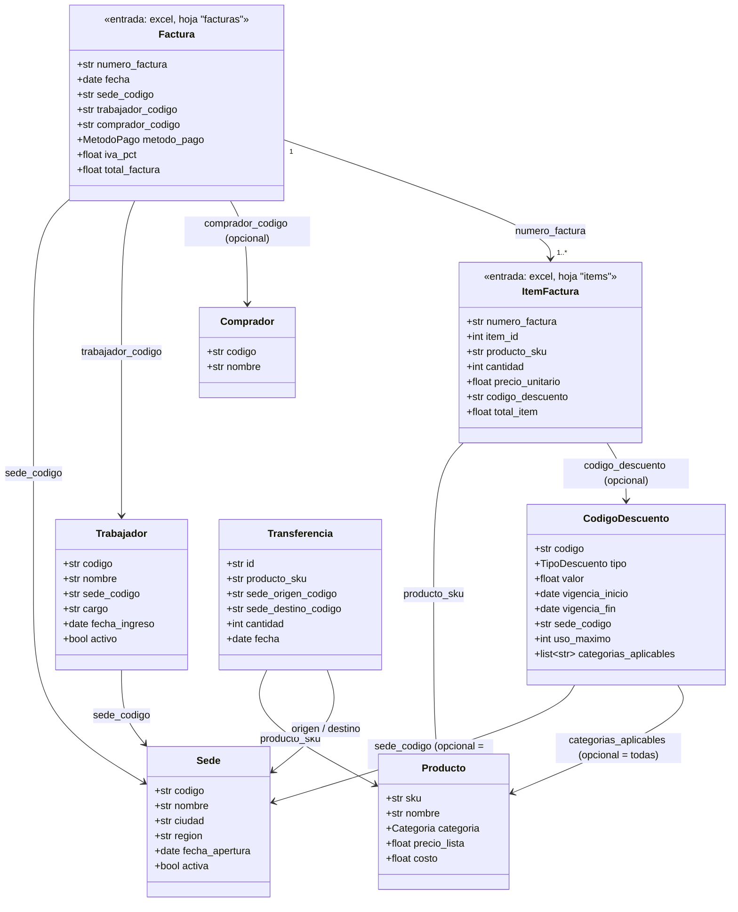

# Modelo de datos

> Complementa a `PLANNING.md` (producto) y `ARCHITECTURE.md` (código). Este
> documento es sobre **qué forma tienen los datos**: las entidades del
> dominio y el esquema de entrada/salida de cada capa del pipeline. Se
> actualiza cada vez que cambia una columna, un tipo, o se agrega una
> entidad — es la referencia para saber qué espera el sistema del excel
> que se sube.

## Entidades y relaciones

Una **factura** tiene una cabecera (`Factura`) y una o más líneas
(`ItemFactura`) — igual que una factura real: varios productos, cada uno
con su cantidad, precio y posible descuento propio, bajo un mismo número
de factura, fecha, sede, trabajador y comprador. Las dos entidades son de
**entrada** (dos hojas del excel subido) y referencian a los catálogos
maestros por código.

Los catálogos (`Sede`, `Trabajador`, `Producto`, `CodigoDescuento`,
`Transferencia`, `Comprador`) viven como tablas Postgres — fuente de
verdad en `infrastructure/db/catalog/models.py`, sembradas por
`scripts/seed_catalog.py`. `Factura`/`ItemFactura` no tienen tabla propia:
son el esquema que el pipeline espera de las 2 hojas del excel — fuente
de verdad en `domain/ventas.py`.

**`Comprador` es opcional y su validación es WARNING, no ERROR**: en
retail real, muchas ventas de mostrador no tienen comprador identificado
— no registrar uno no es un error, solo un dato ausente. Si se registra
un `comprador_codigo` que no existe en el catálogo, ahí sí es una señal
de auditoría real (WARNING).

## Esquema de entrada: excel de facturas (2 hojas)

### Hoja `facturas` (cabecera — una fila por factura)

| Columna | Tipo esperado | Obligatoria | Referencia | Notas |
|---|---|---|---|---|
| `numero_factura` | texto | sí | — | identificador de la factura; no se valida unicidad en silver |
| `fecha` | fecha `YYYY-MM-DD` | sí | — | |
| `sede_codigo` | texto | sí | `Sede.codigo` | la existencia contra el catálogo se valida en gold, no en silver |
| `trabajador_codigo` | texto | sí | `Trabajador.codigo` | ídem |
| `comprador_codigo` | texto | no | `Comprador.codigo` | vacío/nulo = venta sin comprador identificado |
| `metodo_pago` | uno de `MetodoPago` | sí | `domain/ventas.py` | `EFECTIVO`, `TARJETA`, `TRANSFERENCIA` |
| `iva_pct` | número 0-100 | sí | — | porcentaje de IVA aplicado a la factura |
| `total_factura` | número positivo | sí | — | que cuadre con la suma de los ítems + IVA se valida en gold (`factura_total_cuadra`) |

### Hoja `items` (una fila por ítem de una factura)

| Columna | Tipo esperado | Obligatoria | Referencia | Notas |
|---|---|---|---|---|
| `numero_factura` | texto | sí | `facturas.numero_factura` | FK a la hoja de cabecera; si no existe ahí, es un error estructural del ítem |
| `producto_sku` | texto | sí | `Producto.sku` | la existencia contra el catálogo se valida en gold |
| `cantidad` | entero positivo | sí | — | acepta `"2"` o `"2.0"`, rechaza `"2.5"` |
| `precio_unitario` | número positivo | sí | — | |
| `codigo_descuento` | texto | no | `CodigoDescuento.codigo` | vacío/nulo = sin descuento |
| `total_item` | número positivo | sí | — | subtotal del ítem SIN IVA; que cuadre con `cantidad × precio_unitario − descuento` se valida en gold (`item_cuadra`) |

Fuente de verdad en código: `domain/ventas.py` (`FACTURA_COLUMNAS_*`,
`ITEM_COLUMNAS_*`, `MetodoPago`).

## Esquema de salida por capa

### Bronze

Las 2 hojas tal cual llegaron, cada una con **todas sus columnas como
texto** (`Utf8`), sin agregar ni quitar nada. Ver `domain/pipeline/bronze.py`
(`to_bronze` devuelve `(facturas, items)`; lee con
`pl.read_excel(..., sheet_id=0)`, que carga todas las hojas).

### Silver

Mismas columnas que `Factura`/`ItemFactura`, pero tipadas, más dos
columnas de trazabilidad cada una. Ver `domain/pipeline/silver.py`
(`to_silver_facturas`, `to_silver_items`).

**`silver/facturas`**:

| Columna | Tipo |
|---|---|
| `numero_factura` | `Utf8` |
| `fecha` | `Date` (o `null` si no parseó) |
| `sede_codigo` | `Utf8` |
| `trabajador_codigo` | `Utf8` |
| `comprador_codigo` | `Utf8`, nullable |
| `metodo_pago` | `Utf8` |
| `iva_pct` | `Float64` (o `null` si no era 0-100) |
| `total_factura` | `Float64` (o `null` si no era positivo) |
| `_errores` | `List[Utf8]` — mensajes de validación estructural que falló |
| `_es_valida` | `Bool` — `_errores` vacío |

**`silver/items`**:

| Columna | Tipo |
|---|---|
| `numero_factura` | `Utf8` |
| `item_id` | `Int64` — posicional (1..N dentro de cada factura), asignado por silver, no viene del excel |
| `producto_sku` | `Utf8` |
| `cantidad` | `Int64` (o `null` si no era entero positivo) |
| `precio_unitario` | `Float64` (o `null` si no era positivo) |
| `codigo_descuento` | `Utf8`, nullable |
| `total_item` | `Float64` (o `null` si no era positivo) |
| `_errores` | `List[Utf8]` — incluye "numero_factura no existe en la hoja 'facturas'" si aplica |
| `_es_valida` | `Bool` — `_errores` vacío |

Silver **no** descarta filas ni valida contra los catálogos maestros (eso
es referencial/de negocio, no estructural) — solo tipo/formato/
obligatoriedad, más la única excepción referencial que sí puede evaluar
sin catálogos: que el `numero_factura` de cada ítem exista en la hoja de
facturas. Si el excel no tiene ni las columnas mínimas de alguna hoja,
`to_silver_facturas`/`to_silver_items` lanzan `SilverSchemaError` en vez
de producir una tabla (error de archivo completo, no de fila).

### Gold

Una tabla plana con una fila por **evaluación de regla**, incluye tanto
lo que pasó como lo que falló (`paso: true/false`), no solo las
violaciones. Genera `domain/rules/engine.py`, orquestado por
`domain/pipeline/gold.py`.

| Columna | Tipo | Notas |
|---|---|---|
| `numero_factura` | `Utf8` | |
| `item_id` | `Int64`, nullable | `null` para reglas de **cabecera** (una evaluación por factura); con valor para reglas de **ítem** (una evaluación por ítem) |
| `sede_codigo` | `Utf8` | denormalizado, para filtrar sin join |
| `fecha` | `Date` | ídem |
| `regla` | `Utf8` | nombre de la regla, ver tabla abajo |
| `severidad` | `Utf8` | `ERROR` \| `WARNING` |
| `paso` | `Bool` | |
| `mensaje` | `Utf8` | `"OK"` si pasó, explicación si no |

**18 reglas estáticas** (las dinámicas/configurables por JSONLogic son un
motor aparte, pendiente — ver `PLANNING.md` §7). Cada regla es
**endógena** (compara el registro contra sí mismo, ninguna fuente
externa) o **exógena** (compara contra otra fuente de verdad: los
catálogos maestros) — misma distinción que explica la landing page
(`landing.validationTitle`). Y cada regla es de **cabecera** (evalúa
`silver/facturas`, una vez por factura) o de **ítem** (evalúa
`silver/items`, una vez por ítem).

**Reglas de cabecera**:

| Regla | Severidad | Tipo | Qué valida |
|---|---|---|---|
| `sede_existe` | ERROR | exógena | `sede_codigo` existe en el catálogo |
| `sede_activa` | ERROR | exógena | la sede no está inactiva/cerrada (N/A si no existe) |
| `trabajador_existe` | ERROR | exógena | `trabajador_codigo` existe |
| `trabajador_activo` | ERROR | exógena | el trabajador no está inactivo (N/A si no existe) |
| `trabajador_pertenece_a_sede` | ERROR | exógena | el trabajador es de esa sede, no otra (N/A si no existe) |
| `comprador_existe` | WARNING | exógena | si se registró un comprador, que exista (N/A si no se registró) |
| `fecha_no_futura` | ERROR | endógena | la factura no es de una fecha futura |
| `fecha_posterior_a_apertura` | ERROR | exógena | la factura no es anterior a que la sede abriera |
| `factura_total_cuadra` | ERROR | endógena | `total_factura ≈ (Σ total_item de sus ítems) × (1 + iva_pct/100)` (tolerancia 0.01) |

**Reglas de ítem**:

| Regla | Severidad | Tipo | Qué valida |
|---|---|---|---|
| `producto_existe` | ERROR | exógena | `producto_sku` existe |
| `codigo_descuento_existe` | ERROR | exógena | si se usó un código, que exista (N/A si no se usó) |
| `codigo_descuento_vigente` | WARNING | exógena | la fecha de la factura cae en la vigencia del código |
| `codigo_descuento_aplica_a_sede` | WARNING | exógena | el código es global o es de esa sede |
| `codigo_descuento_aplica_a_categoria` | WARNING | exógena | el código es de aplicación general o incluye la categoría de este producto |
| `item_cuadra` | ERROR | endógena | `total_item ≈ cantidad × precio_unitario − descuento` (tolerancia 0.01) |
| `margen_no_negativo` | WARNING | exógena | `precio_unitario ≥ costo` del producto |
| `cantidad_dentro_de_transferencias` | WARNING | exógena | chequeo **simplificado**: suma total histórica de transferencias hacia esa sede para ese SKU ≥ cantidad vendida (no es un balance temporal ordenado por fecha — ver "Abierto" en `PLANNING.md`) |
| `item_duplicado_en_factura` | ERROR | endógena | el mismo `producto_sku` no se repite **dentro de la misma factura** (debería ser una sola línea con la cantidad sumada) |

Una regla "N/A" (el prerequisito no existe, ej. el trabajador no existe)
pasa de forma vacía — no se penaliza dos veces el mismo problema de raíz.

**Sobre `factura_total_cuadra` e `item_cuadra`**: son la validación
"endógena a nivel de cabecera" vs "endógena a nivel de ítem" — el total
de la factura debe cuadrar con la suma de sus ítems más IVA
(`factura_total_cuadra`), y el total de cada ítem debe cuadrar con su
propia aritmética (`item_cuadra`). Es la misma idea de reconciliación de
totales que en un sistema transaccional real, ahora con dos niveles
porque el dominio sí modela facturas multi-ítem.

**Re-ejecución independiente**: `gold` se puede regenerar sin volver a
subir el excel ni rehacer bronze/silver — lee `silver/facturas` y
`silver/items` ya guardados en Delta + el estado **actual** de los
catálogos en Postgres (`POST /audits/{id}/run-gold`, ver
`ARCHITECTURE.md`). Útil para re-auditar después de corregir algo en un
catálogo, o después de crear/editar una regla dinámica (ver abajo) — el
frontend expone esto como el botón "Re-run gold" en el detalle del job.

### Reglas dinámicas (configurables desde el frontend, `/app/rules`)

Además de las 18 estáticas, `gold` puede incluir reglas dinámicas —
configurables desde el frontend, guardadas en la tabla Postgres
`rule_definitions`, sin tocar código ni redeploy. Producen filas con
exactamente el mismo esquema que las estáticas (comparten el helper
`construir_resultado()` en `domain/rules/types.py`), así que conviven en
la misma tabla plana y `dashboard`/`matrix`/`gold/query`/`export` las
tratan igual que a cualquiera de las 18 sin necesitar código aparte —
todos esos endpoints ya agregaban por lo que viniera en la columna
`regla`, no por una lista fija de nombres.

Son un **DSL tabular propio de dos tipos**, no JSONLogic (decisión
2026-09-03, ver `PLANNING.md` §4/§7): cada tipo se traduce 1:1 a una
expresión de Polars, consistente con que el resto del motor ya es
vectorizado.

- **UMBRAL** (`domain/rules/dynamic.py::_evaluar_umbral`): compara un
  `campo` contra un `valor` con un `operador`
  (`>`,`>=`,`<`,`<=`,`==`,`!=`). El operador+valor describe la
  **condición de violación**, no la de paso (ej. "descuento_pct > 0.20"
  es la regla, no su negación). Ámbito CABECERA o ÍTEM, con filtros
  opcionales `filtro_categoria` (solo ÍTEM) y `filtro_sede` (ambos).
  Campos permitidos (whitelist fija, expuesta en `GET /rules/fields`):
  cabecera `total_factura`, `iva_pct`; ítem `cantidad`,
  `precio_unitario`, `total_item`, y dos campos **calculados** solo para
  este evaluador (no tocan `engine.py`): `descuento_pct = 1 −
  total_item/(cantidad×precio_unitario)` y `margen_pct =
  (precio_unitario − costo)/precio_unitario`. Si el campo (calculado o
  no) es `null` para una fila, o un filtro no aplica, la regla pasa para
  esa fila (N/A) — mismo patrón que las reglas estáticas.
- **VENTANA_EXCLUSION** (`_evaluar_ventana`): una `sede_codigo` no
  debería tener ventas entre `fecha_inicio` y `fecha_fin` (ej. "sede en
  mantenimiento"). Siempre ámbito CABECERA.

El nombre de una regla dinámica no puede reusar uno de los 18 nombres
estáticos (`domain/rules/engine.py::NOMBRES_REGLAS_ESTATICAS`) ni el de
otra regla dinámica — validado en `api/rules/service.py`. Una regla
`activa=false` se guarda pero no se evalúa (filtrado en
`domain/rules/dynamic.py::evaluar_dinamicas`, no en infraestructura).

**Generador sintético**: `domain/demo/generator.py` (`POST
/demo/generate-excel`) genera facturas (1-5 ítems cada una) e inyecta
violaciones usando estos mismos nombres de regla (más 6 tipos a nivel
silver: `numero_factura_vacio`, `fecha_invalida`, `iva_pct_invalido`,
`total_factura_invalido`, `cantidad_invalida`, `precio_unitario_invalido`,
`total_item_invalido`, `metodo_pago_no_reconocido`) — así el reporte de
"qué se inyectó" se puede comparar directo contra la columna `regla` de
gold. El conteo inyectado es una aproximación por lo bajo: algunas
mutaciones cascadean a otras reglas de forma legítima (ej. una sede
inexistente también hace fallar `trabajador_pertenece_a_sede`, o mutar el
total de un ítem también hace que `factura_total_cuadra` deje de cuadrar
en la cabecera) — eso es correcto, no un bug.

## Convención de rutas del pipeline en el bucket

Ver `ARCHITECTURE.md` → "Convención de rutas en el bucket"
(`jobs/{upload_id}/upload|bronze/facturas|bronze/items|silver/facturas|silver/items|gold/`).
